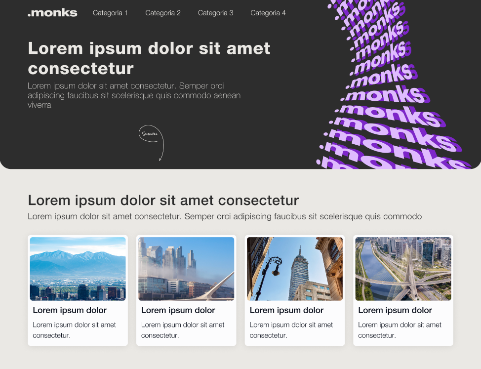

# Psel Desenvolvimento 2025




> Projeto desenvolvido como parte do Processo Seletivo da empresa Monks.

Este projeto utiliza **React** para o front-end e **WordPress** como CMS e API para o backend.

## ✨ Melhorias Futuras

O projeto ainda pode ser aprimorado com as seguintes melhorias:

- [ ] Hospedagem do WordPress em um servidor online
- [ ] Aprimoramento da responsividade para dispositivos móveis
- [ ] Expansão do conteúdo disponível na API


## 🚀 Como utilizar

Para instalar e executar o projeto, siga as etapas abaixo:

### 1️⃣ Clonando o repositório

No terminal, execute os seguintes comandos:

```bash
# Clone o repositório
git clone https://github.com/Matheusccp2/psel-monks-analista-matheus-costa.git

# Acesse o diretório do projeto
cd psel-monks-analista-matheus-costa
```

### 2️⃣ Configurando o WordPress localmente

O projeto utiliza o **LocalWP** para rodar o WordPress localmente. Caso ainda não tenha instalado, baixe e instale através do link abaixo:

🔗 [Download do LocalWP](https://localwp.com/)

Após instalar o LocalWP, siga os passos abaixo:

1. No diretório do projeto, acesse a pasta `LocalWP`.
2. Dentro dela, haverá um arquivo chamado `psel-monks-analista-matheus-costa.zip`.
3. Abra o LocalWP e clique em **Importar site**.
4. Selecione o arquivo `.zip` e aguarde a importação.

Isso criará um novo ambiente WordPress com a API REST configurada.

### 3️⃣ Importando o Banco de Dados

1. No LocalWP, vá até a aba **Database**.
2. Clique em **Connect > Open Adminer**. Isso abrirá um painel de administração do banco de dados.
3. Na interface do Adminer, clique em **Importar**.
4. Selecione o arquivo `local.sql` que está na pasta `LocalWP` do projeto.
5. Confirme a importação do banco de dados.

### 4️⃣ Credenciais de Acesso ao WordPress

Após a configuração, utilize as credenciais abaixo para acessar o painel administrativo do WordPress:

```
Usuário: recrutador
Senha: @Monks1234
```

### 5️⃣ Executando o Front-end

Agora que o backend está configurado, podemos rodar o front-end React.

1. Instale as dependências do projeto:

```bash
npm install
```

2. Inicie o servidor de desenvolvimento:

```bash
npm run dev
```

O site estará disponível em `http://localhost:5173` (ou outra porta exibida no terminal).


## 🛠️ Tecnologias Utilizadas

- **React.js** → Interface do usuário
- **WordPress** → CMS e API REST
- **LocalWP** → Ambiente de desenvolvimento do WordPress
- **Adminer** → Gerenciamento do banco de dados


## 📜 Licença

Este projeto foi desenvolvido para fins de teste técnico e não possui uma licença específica.

